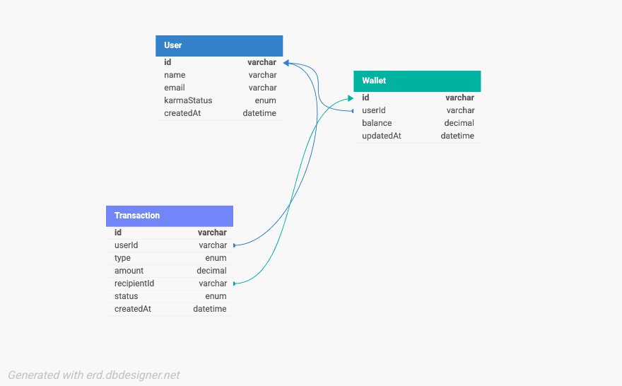

# Demo Credit Wallet Service

## Overview

This project is an MVP wallet service for **Demo Credit**, a mobile lending app. Built with **NodeJS**, **TypeScript**, and **MySQL**, it allows users to:

- Create accounts (with blacklist check via Lendsqr Adjutor Karma)
- Fund their wallets
- Transfer funds to others
- Withdraw funds

## Tech Stack

- **NodeJS (LTS)** – Scalable, high-performance runtime
- **TypeScript** – Strong typing for maintainable code
- **KnexJS** – SQL query builder for MySQL
- **MySQL** – Relational database
- **Jest** – Testing framework for unit tests

## Design and Architecture

### Approach

- **Modular Design**: Separation of concerns via controllers, services, models  
- **DRY Principle**: Reusable utilities and shared configurations  
- **Database Transactions**: Ensures integrity in fund movements  
- **Faux Authentication**: Token-based simulation to keep focus on wallet logic  
- **Karma Blacklist Integration**: Prevents blacklisted users from signing up

### Key Decisions

- Used **UUIDs** for IDs to guarantee uniqueness  
- Wallet balances use `decimal(10,2)` for accurate currency handling  
- Enums for `transactionType` and `status` improve consistency  
- Full authentication omitted per MVP scope

## Database Design

### E-R Diagram

 <!-- Adjust path if stored elsewhere -->

### Entities

#### User

| Field        | Type                            | Notes                      |
|--------------|----------------------------------|----------------------------|
| `id`         | varchar(32)                      | Primary key, unique        |
| `name`       | varchar(255)                     |                            |
| `email`      | varchar(255)                     | Unique                     |
| `karmaStatus`| enum(`clean`, `blacklisted`)     |                            |
| `createdAt`  | datetime                         |                            |
| `updatedAt`  | datetime                         |                            |

#### Wallet

| Field        | Type        | Notes                             |
|--------------|-------------|-----------------------------------|
| `id`         | varchar(32) | Primary key, unique               |
| `userId`     | varchar(32) | FK to User.id, one wallet/user    |
| `balance`    | decimal(10,2)|                                   |
| `createdAt`  | datetime     |                                   |
| `updatedAt`  | datetime     |                                   |

#### Transaction

| Field        | Type                                | Notes                             |
|--------------|--------------------------------------|-----------------------------------|
| `id`         | varchar(32)                          | Primary key, unique               |
| `userId`     | varchar(32)                          | FK to User.id                     |
| `type`       | enum(`fund`, `transfer`, `withdrawal`)| Transaction category              |
| `amount`     | decimal(10,2)                        |                                   |
| `recipientId`| varchar(32)                          | FK to Wallet.id                   |
| `status`     | enum(`pending`, `completed`, `failed`)| Status of the transaction         |
| `createdAt`  | datetime                             |                                   |
| `updatedAt`  | datetime                             |                                   |

## Project Structure

```shell
src/
├── controllers/     # Handles HTTP logic
├── services/        # Core business logic
├── models/          # Knex schemas and DB interactions
├── tests/           # Unit tests (Jest)
├── utils/           # Helpers (tokens, API calls, etc.)
├── config/          # Environment/database configs
```


# Setup Instructions

## Prerequisites

- NodeJS (LTS)

- MySQL

- Lendsqr Adjutor API key

## Installation

```bash

# Clone the repository

git clone <https://github.com/spyatmycode/akeju-oluwanifemi-lendsqr-be-test.git>

cd akeju-oluwanifemi-lendsqr-be-test

# Install dependencies

npm install

```

## Environment Setup

Create a `.env` file in the root of the project and add the following environment variables:

```env


DB_HOST=
DB_USER=root
DB_PASSWORD=
DB_NAME=
ADJUTOR_API_KEY=
PORT=

```

## Database Migration

Run the following command to apply the latest database migrations:

```bash

npx knex migrate:latest

```

# Running the App

## Development

To run the application in a development environment with hot-reloading:

```shell

npm run dev

```

## Production

To build and run the application for production:

```shell

npm start

```

# Testing

Run unit tests with:

```shell

npm test

```

## Test Coverage

### Positive Cases:

- Account creation

- Funding a wallet

- Transferring funds to another wallet

- Withdrawing funds from a wallet

### Negative Cases:

- Prevention of blacklisted user creation

- Handling of insufficient funds for transfers and withdrawals

# API Endpoints

| Method        | Endpoint                                | Description                    |
|--------------|--------------------------------------|-----------------------------------|
| `POST`        |/users                           | Create a user account (with blacklist)               |
| `POST`     |/wallet/fund                          | Fund a wallet                     |
| `POST`     |/wallet/transfer                         | Transfer funds to another wallet |
| `POST`     |/wallet/withdraw                         | Withdraw funds from a wallet                     |


# Deployment

- **Hosting:** Hosted on Heroku: https://akeju-oluwanifemi-lendsqr-be-test.onrender.com

- **Database:** MySQL hosted on a JawsDB MySQL (Free Tier)

- **Environment Configuration:** Managed through Render's dashboard.

# GitHub

Repository: <https://github.com/spyatmycode/akeju-oluwanifemi-lendsqr-be-test>